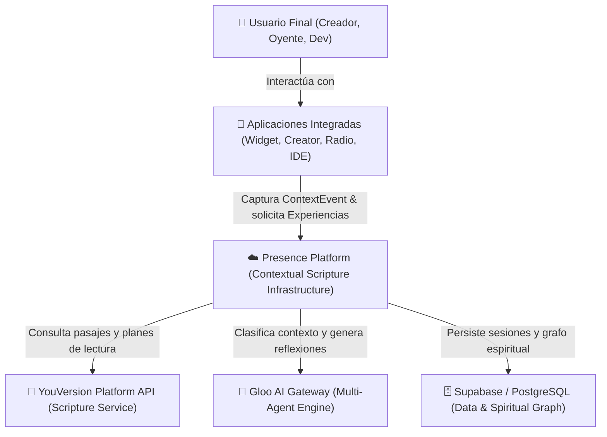
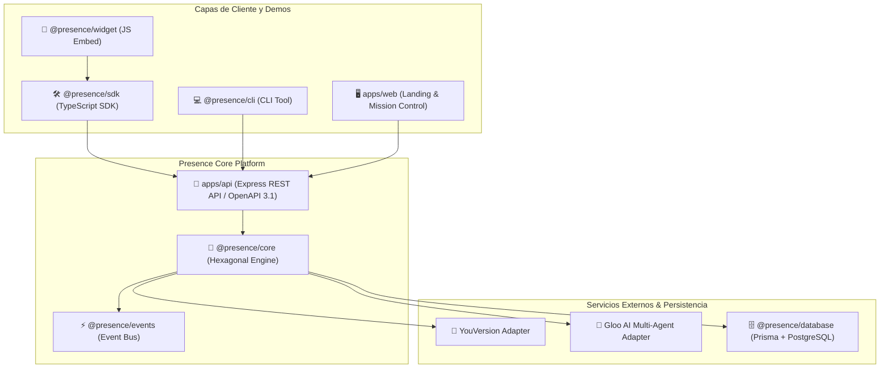
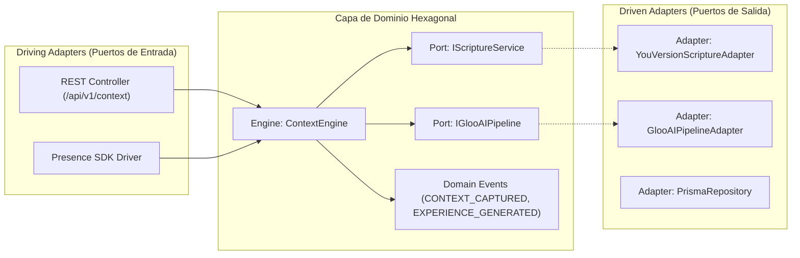

# C4 Architecture Specification: Presence Platform

Esta documentación sigue el estándar **C4 Model** para estructurar la arquitectura del software en distintos niveles de abstracción.

---

## Nivel 1: Diagrama de Contexto del Sistema (System Context)

Muestra cómo **Presence Platform** interactúa con los usuarios finales, aplicaciones cliente de terceros y sistemas externos como YouVersion y Gloo AI.

---

## Nivel 2: Diagrama de Contenedores (Containers)

Muestra los contenedores de software que componen la plataforma (Apps, SDK, API REST, Motors y Almacenamiento).

---

## Nivel 3: Diagrama de Componentes Hexagonales (Components)

Desglose interno de `@presence/core` demostrando el aislamiento de la Capa de Dominio mediante Puertos y Adaptadores (Hexagonal Architecture).

