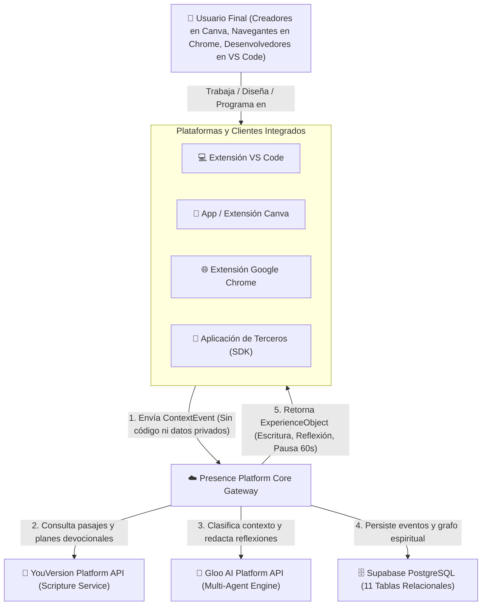
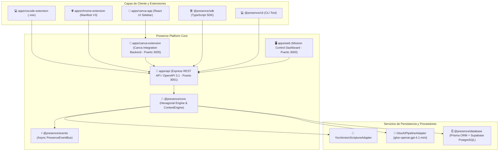
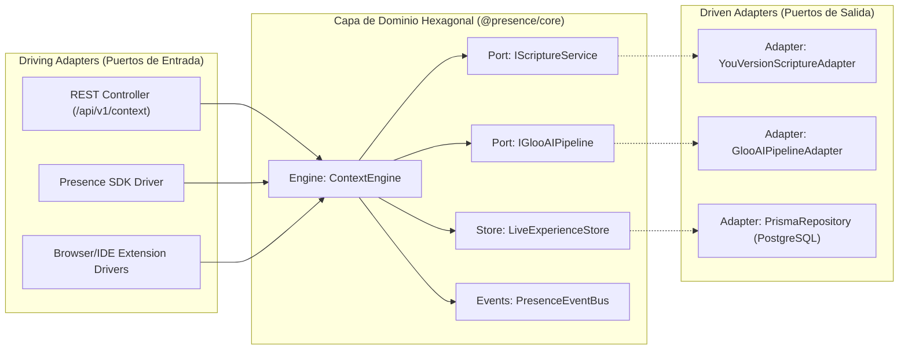
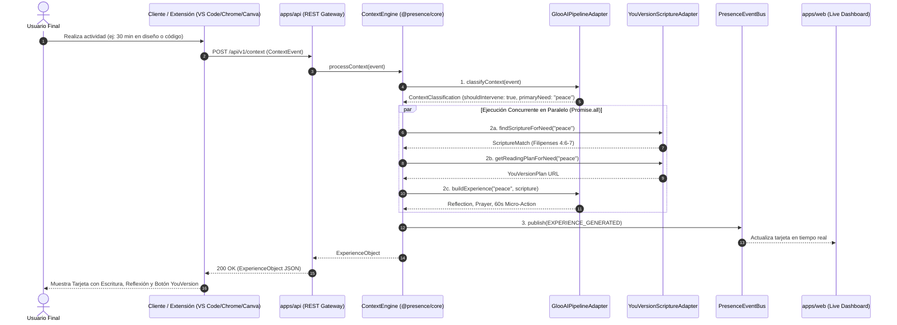

# 🏛️ Especificación de Arquitectura de Software & Diagramas C4

> **Presence Platform — Contextual Scripture Infrastructure**  
> Documentación técnica exhaustiva basada en la metodología **C4 Model** (Contexto, Contenedores y Componentes Hexagonales) con diagramas interactivos en **Mermaid.js**.

---

## 📋 Tabla de Contenidos
1. [Visión General de la Arquitectura](#-visión-general-de-la-arquitectura)
2. [🌐 Nivel 1: Diagrama de Contexto del Sistema (System Context)](#-nivel-1-diagrama-de-contexto-del-sistema-system-context)
3. [🐳 Nivel 2: Diagrama de Contenedores (Containers)](#-nivel-2-diagrama-de-contenedores-containers)
4. [🏛️ Nivel 3: Diagrama de Componentes Hexagonales (Components)](#-nivel-3-diagrama-de-componentes-hexagonales-components)
5. [⚡ Diagrama de Secuencia y Flujo de Ejecución (<800ms)](#-diagrama-de-secuencia-y-flujo-de-ejecución-800ms)
6. [🔒 Principios de Privacidad y Aislamiento Multi-Tenant](#-principios-de-privacidad-y-aislamiento-multi-tenant)

---

## 💡 Visión General de la Arquitectura

Presence Platform está diseñada bajo los patrones de **Arquitectura Hexagonal (Puertos y Adaptadores)** y **Arquitectura Dirigida por Eventos (Event-Driven Architecture)**.

### Principios Fundamentales:
1. **Desacoplamiento Absoluto (B2B2C)**: El núcleo del sistema (`@presence/core`) no conoce los detalles de implementación de los clientes (VS Code, Canva, Chrome, React, Express) ni de los proveedores externos (Gloo AI, YouVersion).
2. **Puertos y Adaptadores**: Los servicios externos se integran mediante interfaces puras (`IScriptureService` y `IGlooAIPipeline`), permitiendo sustituir o alternar modelos de IA sin modificar la lógica del dominio.
3. **Optimización de Latencia Paralela**: Las consultas bíblicas y las llamadas al modelo de IA se ejecutan de forma concurrente mediante promesas paralelas de TypeScript (`Promise.all`), logrando responder en menos de **800 ms**.

---

## 🌐 Nivel 1: Diagrama de Contexto del Sistema (System Context)

El Diagrama de Contexto define cómo los usuarios finales y los sistemas externos interactúan con la frontera de Presence Platform.

### Descripción de Actores y Sistemas:
- **Usuario Final**: Persona realizando actividades de diseño, programación, edición de video o estudio.
- **Clientes Integrados**: Extensiones y SDKs que capturan metadatos de actividad (`activity`, `topic`, `durationSeconds`).
- **Presence Platform**: Núcleo orquestador que ejecuta el discernimiento proactivo.
- **YouVersion Platform API**: Proveedor oficial de versículos bíblicos y planes devocionales.
- **Gloo AI Platform**: Motor de inteligencia artificial que ejecuta los agentes de clasificación y reflexión.

---

## 🐳 Nivel 2: Diagrama de Contenedores (Containers)

El Diagrama de Contenedores muestra los distintos microservicios, módulos y aplicaciones del monorepo Turborepo.

### Detalle de Contenedores:
- **`apps/api` (Puerto 3001)**: Gateway REST en Express. Expone OpenAPI 3.1 y la documentación en Scalar GUI (`http://localhost:3001/docs`).
- **`apps/web` (Puerto 3000)**: Dashboard en tiempo real que transmite la actividad y las reflexiones discernidas.
- **`apps/canva-extension` (Puerto 3005)**: Backend puente para inserción en lienzos de Canva y sincronización con el Dashboard.
- **`@presence/core`**: Paquete npm interno que contiene la lógica pura del dominio, el `ContextEngine` y los adaptadores hexagonales.

---

## 🏛️ Nivel 3: Diagrama de Componentes Hexagonales (Components)

El Diagrama de Componentes ilustra la estructura interna de `@presence/core` aislada mediante Puertos y Adaptadores.

### Componentes de Dominio:
- **`ContextEngine`**: Orquesta el flujo de discernimiento y generación de la experiencia.
- **`IScriptureService`**: Puerto abstracto para búsqueda de pasajes y planes devocionales.
- **`IGlooAIPipeline`**: Puerto abstracto para clasificación de contexto y generación de reflexiones.
- **`LiveExperienceStore`**: Almacén reactivo singleton en memoria para actualizar el Dashboard Web en tiempo real.

---

## ⚡ Diagrama de Secuencia y Flujo de Ejecución (<800ms)

Este diagrama detalla la secuencia temporal sincrónica y asincrónica desde que una extensión cliente envía un evento hasta que la tarjeta se presenta en pantalla y se notifica al Dashboard Web.

---

## 🔒 Principios de Privacidad y Aislamiento Multi-Tenant

1. **Sin lectura de contenido privado**: Presence **nunca** lee ni transmite código fuente, textos de diseño, correos o datos personales.
2. **Evaluación de Metadatos Livianos**: Solamente se analizan cadenas no sensibles (`activity`, `topic`, `durationSeconds`).
3. **Aislamiento Multi-Tenant**: Cada cliente está aislado por `appId` y `machineId` / `userId`, previniendo la contaminación de datos entre usuarios.

---

## 📄 Licencia

MIT License © Team Presence Platform.
